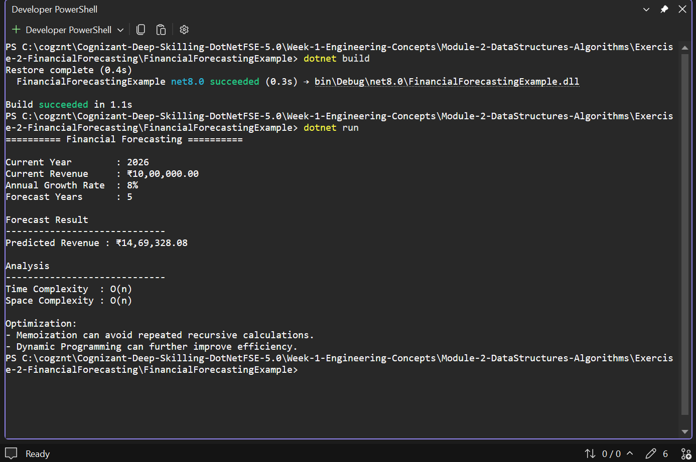

# Exercise 2 - Financial Forecasting

## Objective

Implement Financial Forecasting using Recursion.

## Scenario

A financial forecasting tool predicts future revenue based on current revenue and annual growth rate.

## Concepts Used

- Recursion
- Object-Oriented Programming
- Time Complexity Analysis

## Algorithm

The recursive method calculates the future value using:

Future Revenue = Current Revenue × (1 + Growth Rate)

The function repeatedly calls itself until the forecast period becomes zero.

## Complexity

Time Complexity: O(n)

Space Complexity: O(n)

## Optimization

- Memoization
- Dynamic Programming

## Output

