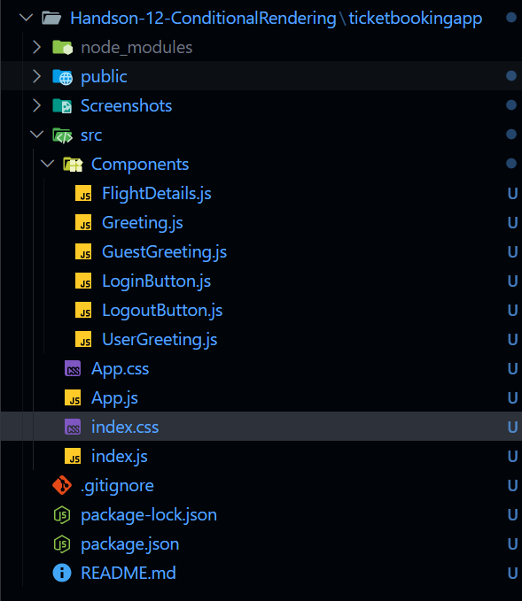
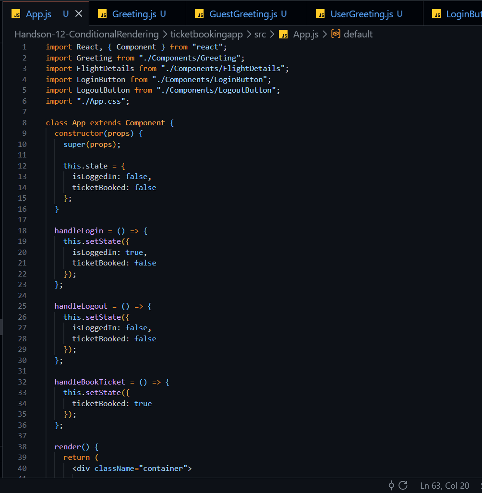
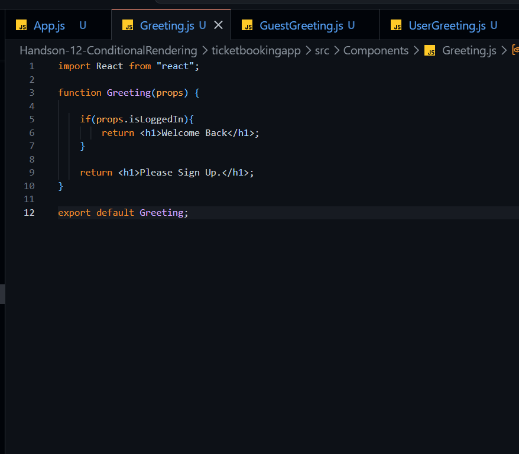
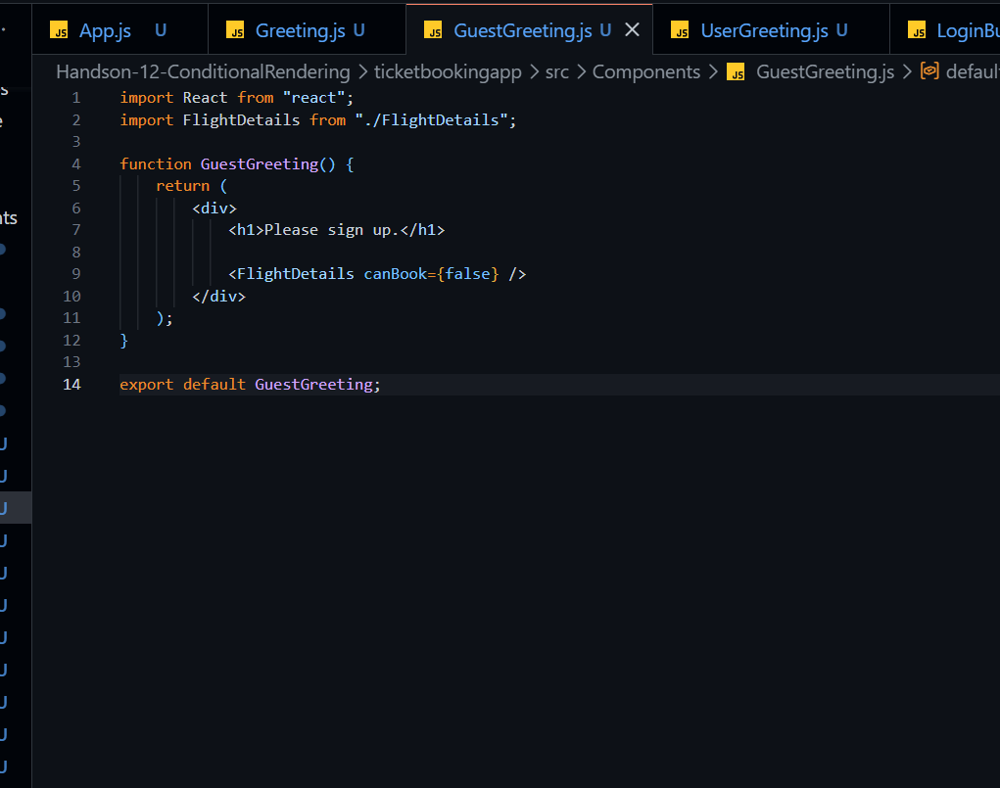
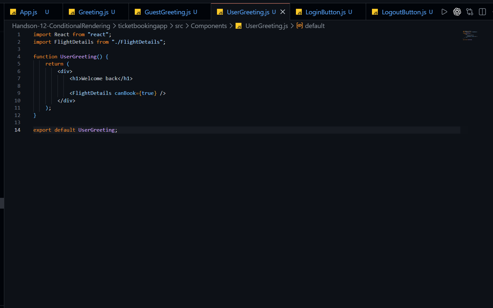
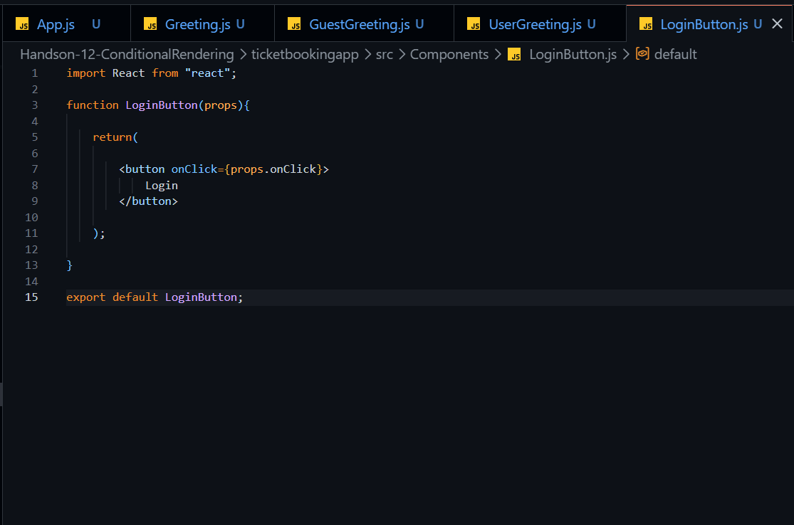
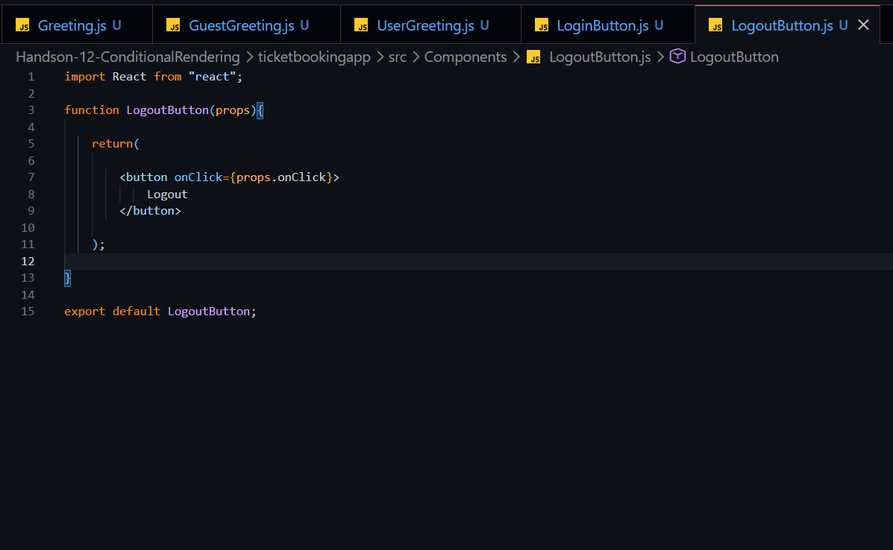
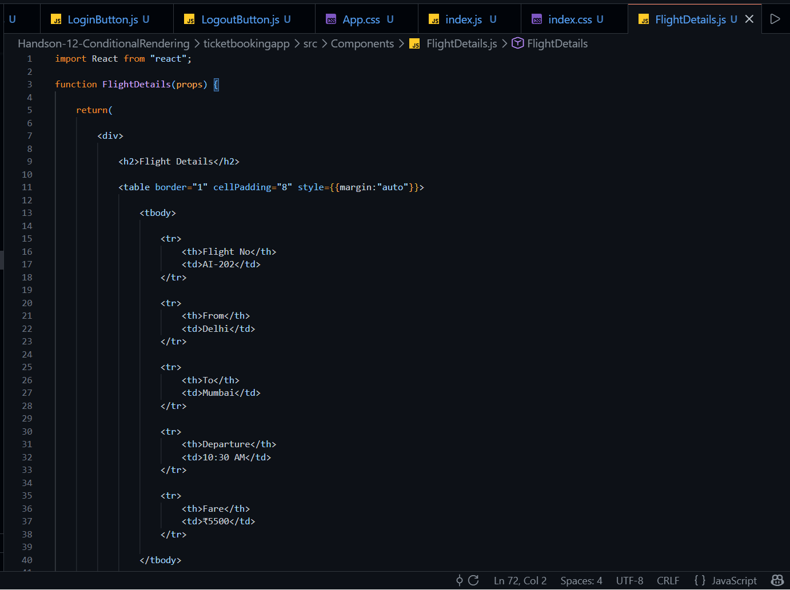
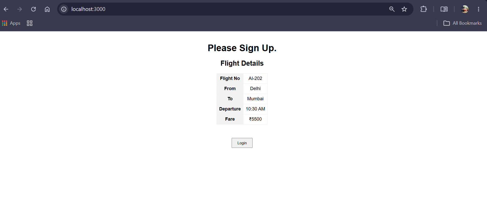
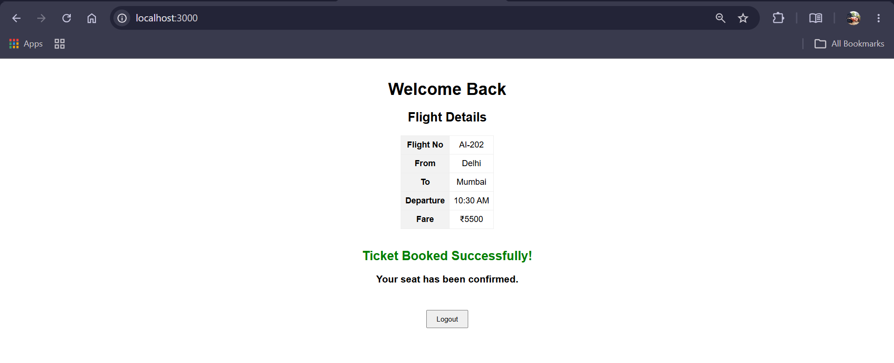

# Handson-12: Conditional Rendering

## Objective

This hands-on demonstrates how to implement **Conditional Rendering** in React using Login and Logout functionality.

### Learning Outcomes

- Understand Conditional Rendering in React
- Learn how to use Element Variables
- Render different components based on application state
- Display different pages for Guest and Logged-in users
- Handle button click events using React state

---

## Problem Statement

Create a React Application named **ticketbookingapp** where the guest user can browse the page where the flight details are displayed whereas the logged-in user only can book tickets.

The Login and Logout buttons should accordingly display different pages.

- Initially, the Guest page should be displayed.
- After clicking **Login**, the User page should be displayed.
- Logged-in users can book tickets.
- Clicking **Logout** should return the application to the Guest page.

---

## Technologies Used

- React JS
- JavaScript (ES6)
- JSX
- CSS
- Node.js
- npm
- Visual Studio Code

---

## Project Structure

```
ticketbookingapp
│
├── public
│   └── index.html
│
├── src
│   ├── Components
│   │   ├── FlightDetails.js
│   │   ├── Greeting.js
│   │   ├── GuestGreeting.js
│   │   ├── UserGreeting.js
│   │   ├── LoginButton.js
│   │   └── LogoutButton.js
│   │
│   ├── App.js
│   ├── App.css
│   ├── index.js
│   └── index.css
│
├── package.json
└── README.md
```

---

## Features

- Guest user can browse flight details.
- Login functionality.
- User page displayed after successful login.
- Book Ticket button available only for logged-in users.
- Ticket booking confirmation message.
- Logout functionality.
- Returns to Guest page after logout.
- Demonstrates Conditional Rendering using React state.

---

## React Concepts Used

- Functional Components
- Class Component
- State
- Props
- Conditional Rendering
- Event Handling
- JSX
- Component Reusability

---

## Application Flow

### Step 1

Application starts in Guest mode.

- Displays Guest page
- Shows Flight Details
- Login button is visible

### Step 2

Click **Login**

- User page is displayed
- Flight Details remain visible
- Book Ticket button appears
- Logout button is displayed

### Step 3

Click **Book Ticket**

- Ticket booking confirmation message is displayed

### Step 4

Click **Logout**

- User is logged out
- Guest page is displayed again

---

# Screenshots

## Project Folder Structure



---

## App.js



---

## Greeting Component



---

## GuestGreeting Component



---

## UserGreeting Component



---

## LoginButton Component



---

## LogoutButton Component



---

## FlightDetails Component



---

## Application Running


---

## Output - Guest Page



---

## Output - Logged-in User Page



---

## Conclusion

This hands-on demonstrates the implementation of **Conditional Rendering** in React by displaying different pages for Guest and Logged-in users. The application uses React state to manage authentication status, conditionally renders components, and allows logged-in users to book tickets while restricting guests to viewing flight details only.