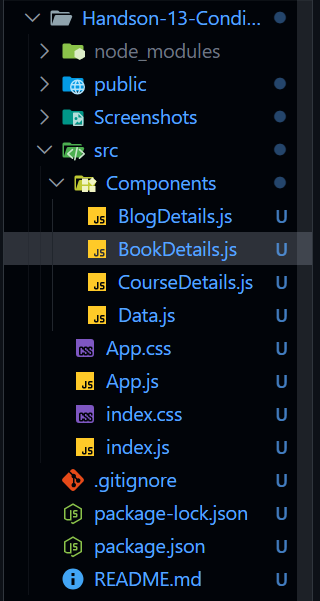
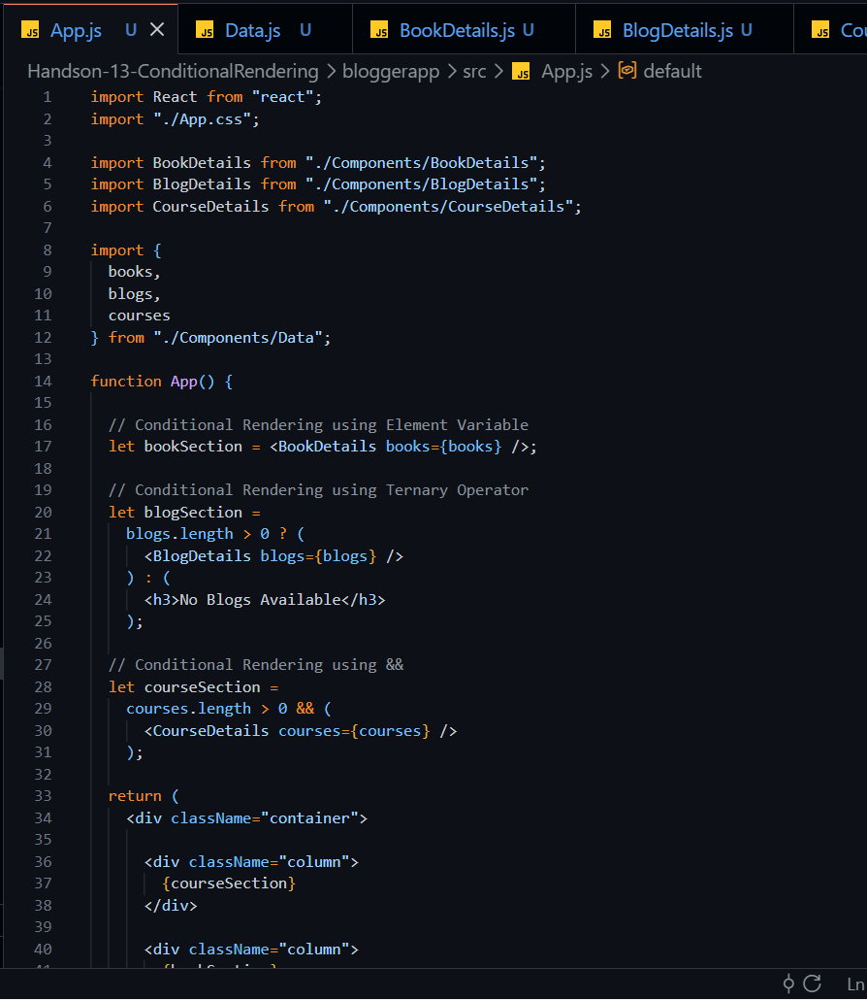
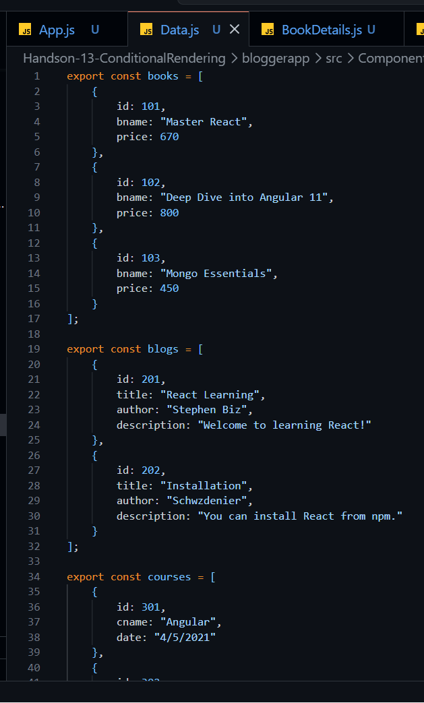
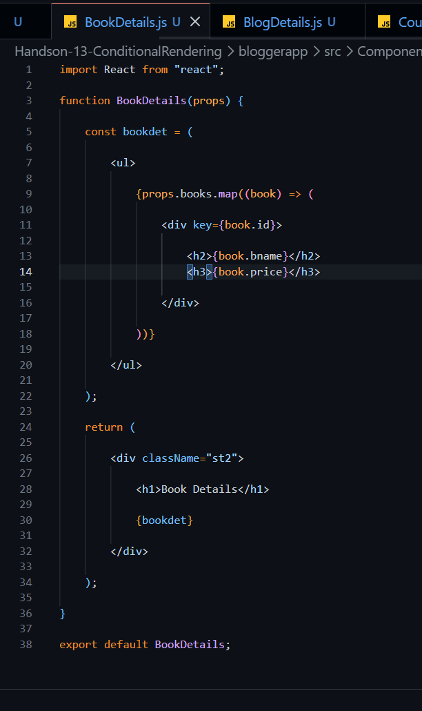
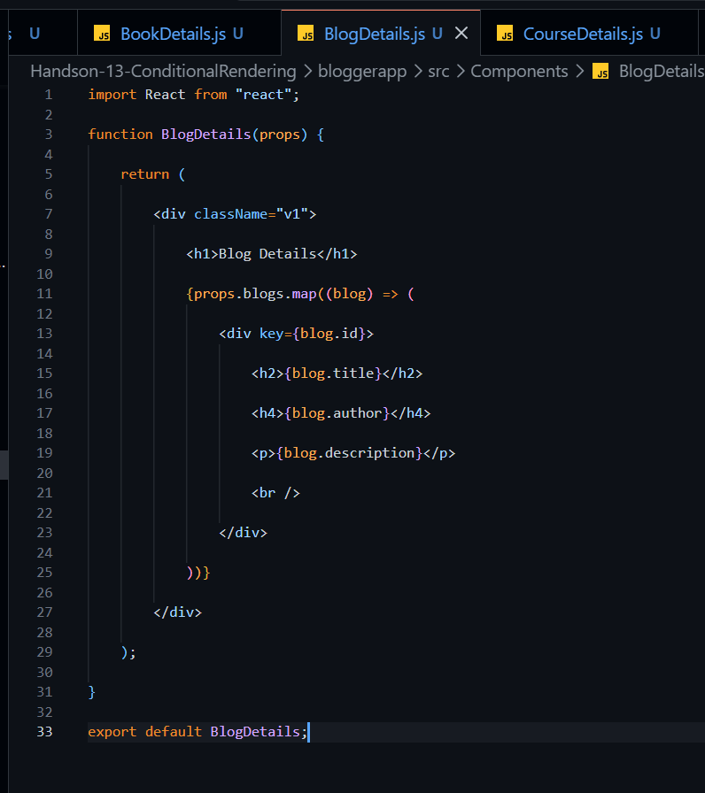
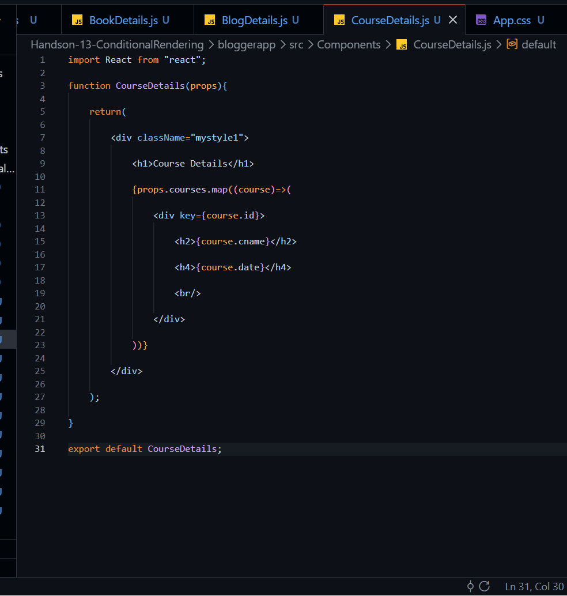
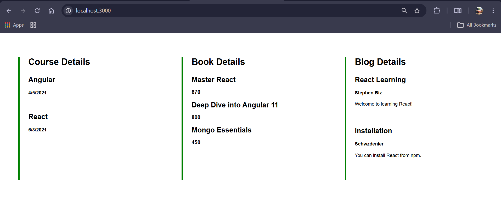

# Week-5 Handson-13: Conditional Rendering

## Objective

This hands-on demonstrates how to implement **Conditional Rendering** in React along with rendering multiple components, displaying lists using the **map()** function, and assigning **keys** to list elements.

### Learning Outcomes

- Understand Conditional Rendering in React.
- Learn different ways of Conditional Rendering.
- Render multiple components in a React application.
- Understand React Lists and Keys.
- Learn how to use the **map()** function.
- Extract components using props.
- Build reusable React components.

---

## Problem Statement

Create a React application named **bloggerapp** consisting of three components:

1. Course Details
2. Book Details
3. Blog Details

Implement these components using different techniques of **Conditional Rendering**. Display the Book Details using the **map()** function and assign a unique **key** to each item.

---

## Technologies Used

- React JS
- JavaScript (ES6)
- JSX
- CSS
- Node.js
- npm
- Visual Studio Code

---

## React Concepts Used

- Functional Components
- JSX
- Props
- Conditional Rendering
- Element Variables
- Ternary Operator
- Logical AND (&&)
- Lists and Keys
- map() Function
- Component Reusability

---

## Project Structure

```
bloggerapp
│
├── public
│   └── index.html
│
├── src
│   ├── Components
│   │   ├── BookDetails.js
│   │   ├── BlogDetails.js
│   │   ├── CourseDetails.js
│   │   └── Data.js
│   │
│   ├── App.js
│   ├── App.css
│   ├── index.js
│   └── index.css
│
├── Screenshots
│   ├── Folder.png
│   ├── App.js.png
│   ├── BookDetails.png
│   ├── BlogDetails.png
│   ├── CourseDetails.png
│   ├── Data.js.png
│   ├── ApplicationRunning.png
│   └── Output.png
│
├── package.json
└── README.md
```

---

# Components Description

## 1. App.js

- Main component of the application.
- Imports all child components.
- Imports data from `Data.js`.
- Demonstrates multiple Conditional Rendering techniques:
  - Element Variable
  - Ternary Operator
  - Logical AND (&&)
- Passes data to child components using props.

---

## 2. Data.js

Stores application data.

Contains three arrays:

- Books
- Blogs
- Courses

These arrays are exported and used inside other components.

---

## 3. BookDetails.js

Displays the list of books.

Uses:

- map() function
- key property
- Props

Displays:

- Book Name
- Price

---

## 4. BlogDetails.js

Displays all blog information.

Displays:

- Blog Title
- Author
- Description

Uses:

- map()
- Props
- key

---

## 5. CourseDetails.js

Displays available courses.

Displays:

- Course Name
- Date

Uses:

- map()
- Props
- key

---

# Conditional Rendering Used

This project demonstrates multiple ways of Conditional Rendering.

### Element Variable

```javascript
let bookSection = <BookDetails books={books} />;
```

---

### Ternary Operator

```javascript
blogs.length > 0
    ? <BlogDetails blogs={blogs} />
    : <h3>No Blogs Available</h3>;
```

---

### Logical AND (&&)

```javascript
courses.length > 0 &&
<CourseDetails courses={courses} />
```

---

# Application Flow

### Step 1

The application starts.

↓

### Step 2

Data is imported from **Data.js**.

↓

### Step 3

The data is passed to individual components using **props**.

↓

### Step 4

Each component renders its own information.

↓

### Step 5

Book Details are displayed using the **map()** function.

↓

### Step 6

Each list item receives a unique **key**.

↓

### Step 7

All three sections are displayed side-by-side.

---

# Features

- Three reusable React components.
- Demonstrates Conditional Rendering.
- Uses React Props.
- Uses map() to render lists.
- Uses unique keys.
- Responsive component-based design.
- Clean folder structure.

---

# Screenshots

## Project Folder Structure



---

## App.js



---

## Data.js



---

## BookDetails Component



---

## BlogDetails Component



---

## CourseDetails Component



---

## Application Running


---

## Final Output



---

# Output

The application displays three sections:

### Course Details

- Angular
- React

### Book Details

- Master React
- Deep Dive into Angular 11
- Mongo Essentials

### Blog Details

- React Learning
- Installation

All sections are displayed in separate columns similar to the expected assignment output.

---

# Conclusion

This hands-on successfully demonstrates **Conditional Rendering** in React by using different rendering techniques such as **Element Variables**, **Ternary Operators**, and **Logical AND (&&)**. It also demonstrates rendering lists using the **map()** function with unique **keys**, making the application modular, reusable, and easy to maintain.