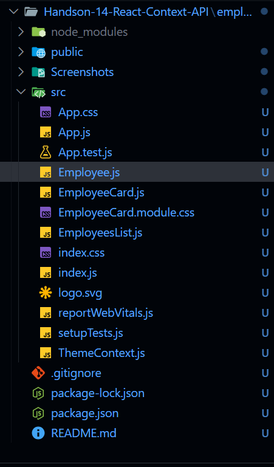
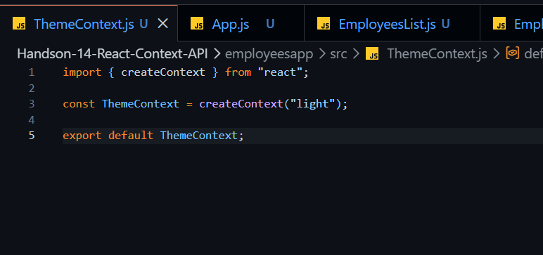
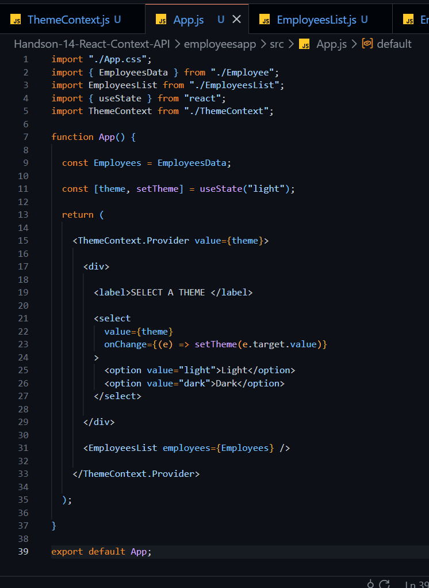
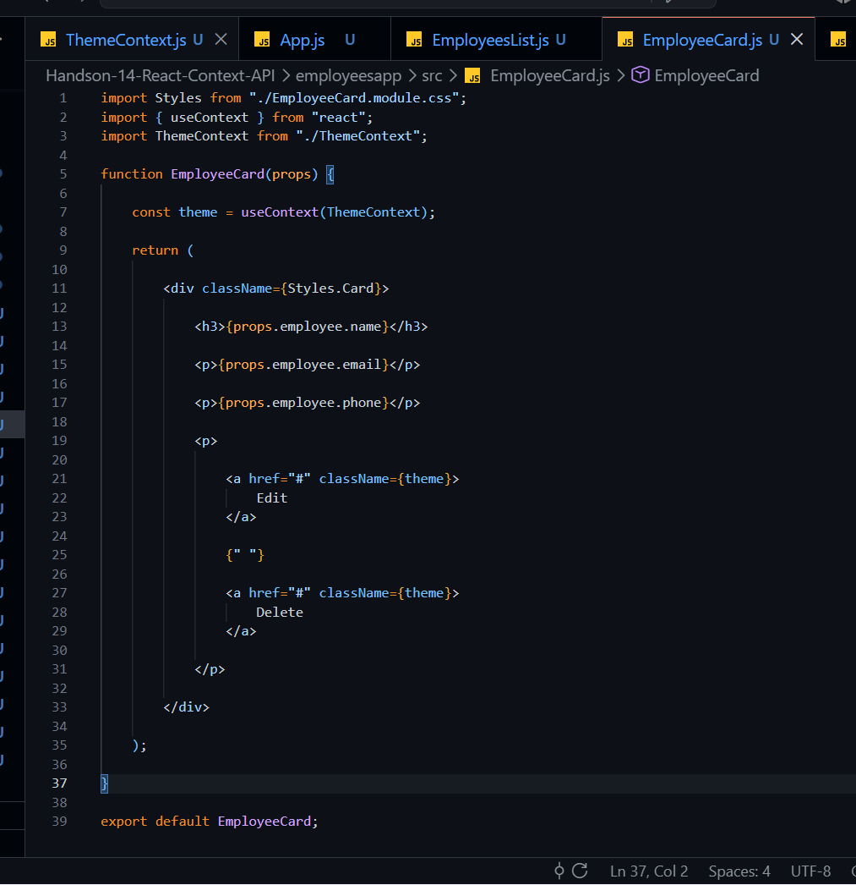

# Week-5 Handson-14: React Context API

## Objective

This hands-on demonstrates how to use the **React Context API** to eliminate prop drilling by sharing data between nested components.

### Learning Outcomes

- Understand the need and benefits of React Context API.
- Learn how to create a context using `createContext()`.
- Implement a Context Provider and Context Consumer.
- Use the `useContext()` hook to access context values.
- Replace prop drilling with Context API.
- Build reusable and maintainable React components.

---

## Problem Statement

Developers of Apps Centric Solutions created an Employee Management Application that supports **Light** and **Dark** themes for action buttons.

Initially, the theme was passed from **App.js** to **EmployeesList.js** and then to **EmployeeCard.js** using **props**. This approach resulted in **prop drilling**.

The objective of this hands-on is to convert the application from using **props** to using the **React Context API**, allowing nested child components to access the theme directly without passing it through intermediate components.

---

## Technologies Used

- React JS
- JavaScript (ES6)
- JSX
- React Context API
- React Hooks (`useState`, `useContext`)
- CSS Modules
- Node.js
- npm
- Visual Studio Code

---

# React Concepts Used

- React Context API
- createContext()
- Context Provider
- useContext()
- Functional Components
- Props
- State Management
- CSS Modules
- Component Reusability

---

# Project Structure

```text
employeesapp
│
├── public
│   └── index.html
│
├── src
│   ├── App.js
│   ├── App.css
│   ├── Employee.js
│   ├── EmployeesList.js
│   ├── EmployeeCard.js
│   ├── EmployeeCard.module.css
│   ├── ThemeContext.js
│   ├── index.js
│   ├── index.css
│   ├── logo.svg
│   ├── reportWebVitals.js
│   └── setupTests.js
│
├── Screenshots
│   ├── Folder.png
│   ├── ThemeContext.png
│   ├── App.js.png
│   ├── EmployeesList.png
│   ├── EmployeeCard.png
│   ├── ApplicationRunning.png
│   ├── LightTheme.png
│   └── DarkTheme.png
│
├── package.json
├── package-lock.json
└── README.md
```

---

# Components Description

## App.js

- Main component of the application.
- Stores the selected theme using `useState()`.
- Provides the theme to all child components using `ThemeContext.Provider`.
- Displays the theme selection dropdown.
- Passes only employee data to `EmployeesList`.

---

## ThemeContext.js

- Creates a new React Context.
- Sets the default theme to **light**.
- Exports the context for use throughout the application.

---

## EmployeesList.js

- Receives employee data as props.
- Displays all employee cards.
- No longer receives or forwards the theme prop.

---

## EmployeeCard.js

- Imports `ThemeContext`.
- Uses the `useContext()` hook to retrieve the selected theme.
- Applies the theme to the Edit and Delete buttons.
- Displays employee information.

---

## Employee.js

Contains employee model and employee data used by the application.

---

# Before Using Context API

```
App.js
   │
 theme
   │
   ▼
EmployeesList.js
   │
 theme
   │
   ▼
EmployeeCard.js
```

The theme was passed through multiple components even though `EmployeesList` did not use it directly.

This approach is called **Prop Drilling**.

---

# After Using Context API

```
           ThemeContext
                 ▲
                 │
App.js (Provider)
                 │
                 ▼
EmployeesList.js
                 │
                 ▼
EmployeeCard.js
          useContext()
```

Now, `EmployeeCard` directly accesses the theme using `useContext()` without requiring intermediate components to pass it as props.

---

# Features

- Light and Dark theme support.
- React Context API implementation.
- Eliminates prop drilling.
- Uses `createContext()`.
- Uses `ThemeContext.Provider`.
- Uses `useContext()`.
- Reusable React components.
- Clean project structure.

---

# Application Flow

### Step 1

The application starts.

↓

### Step 2

The default theme is **Light**.

↓

### Step 3

`App.js` provides the selected theme using `ThemeContext.Provider`.

↓

### Step 4

Employee data is passed to `EmployeesList`.

↓

### Step 5

Each `EmployeeCard` retrieves the current theme using `useContext()`.

↓

### Step 6

The Edit and Delete buttons are styled according to the selected theme.

↓

### Step 7

Changing the theme from the dropdown immediately updates the button styles for all employee cards.

---

# Screenshots

## Project Folder Structure



---

## ThemeContext.js



---

## App.js



---

## EmployeesList.js


---

## EmployeeCard.js



---

## Application Running


---

## Light Theme Output


---

## Dark Theme Output


---

# Output

### Light Theme

- Theme selector is set to **Light**.
- Edit and Delete buttons use the light theme styling.

### Dark Theme

- Theme selector is set to **Dark**.
- Edit and Delete buttons automatically switch to the dark theme styling.

The UI remains the same while the internal implementation changes from prop drilling to the React Context API.

---

# Advantages of React Context API

- Eliminates prop drilling.
- Improves code readability.
- Simplifies data sharing between nested components.
- Makes components more reusable.
- Easier to maintain and extend.

---

# Conclusion

This hands-on successfully demonstrates the implementation of the **React Context API** by replacing prop drilling with a centralized context. The application uses `createContext()`, `ThemeContext.Provider`, and the `useContext()` hook to share the selected theme across nested components, resulting in cleaner, more maintainable, and reusable React code.